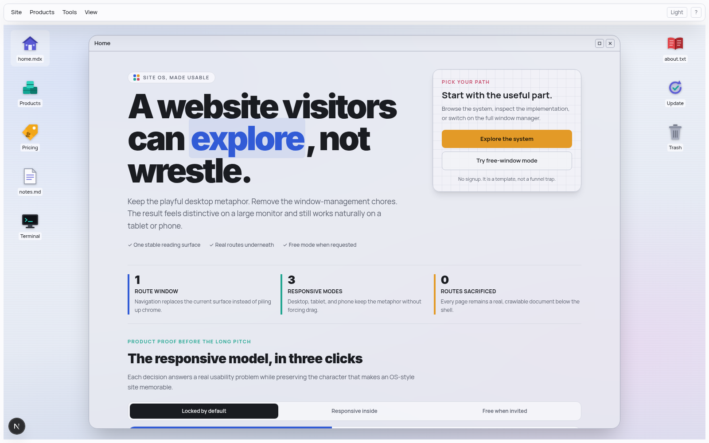

# Site OS

[](https://github.com/AgriciDaniel/site-os/actions/workflows/ci.yml)
[](LICENSE)
[](package.json)

A responsive Next.js template that presents ordinary website routes inside a
playful operating-system shell. Its default is intentionally simple: one stable
route window on desktop, tablet, and phone. A full draggable multi-window
desktop remains available as an optional playground.



The shell includes responsive app windows, a mobile three-column launcher,
desktop icons, menus, themes, wallpapers, keyboard shortcuts, and a working
terminal. Free-window mode adds live dragging, resizing, snapping,
minimize/maximize/restore controls, and a dock. The shell is additive: every
route remains a real server-rendered document underneath it.

## Requirements

- Node.js 22 or newer (tested in CI on Node.js 22 and 24)
- npm 10 or newer

No environment variables or external services are required.

## Quick start

```bash
git clone git@github.com:AgriciDaniel/site-os.git
cd site-os
npm ci
npm run dev
```

Open [http://localhost:3100](http://localhost:3100).

For a production check:

```bash
npm run typecheck
npm run build
npm start
```

## Responsive experiences

The default `/?experience=os` presentation adapts without abandoning the OS
metaphor:

- **Desktop:** one centered route window, top menu bar, and icons at both edges.
- **Tablet:** one inset route window; the menu bar steps out of the way.
- **Phone:** one full-surface route window. Closing it reveals a three-column
  app launcher, and icons open with a single tap.

The window is locked by default, so its title bar does not drag and route
navigation replaces its content instead of opening overlapping windows.
Window contents use container queries, which means they respond to the space
inside the window rather than only the browser viewport.

Available URLs:

- `/?experience=os` — responsive locked-window Site OS (default)
- `/?experience=os&windows=free` — draggable multi-window desktop
- `/?experience=boring` — conventional scrolling site

The server renders the conventional document before the client shell mounts, so
route content remains available without JavaScript and straightforward for
crawlers to read.

## What is included

- Next.js App Router with React and TypeScript
- Tailwind CSS with semantic color tokens
- Framer Motion for window movement
- dnd-kit for desktop icon movement
- Radix primitives for menus and scroll areas
- Static, crawlable pages for Home, Products, Pricing, About, Notes, Terminal, Update, and Trash
- Light/dark themes, modern/classic window skins, three CSS wallpapers, reduced transparency, and an FPS meter
- A Playwright behavior suite in `verify.py`
- A reusable responsive, color, and marketing playbook in
  `docs/site-os-design-playbook.md`

## Project map

| Location | Purpose |
| --- | --- |
| `app/` | Real routes, global styles, metadata, and the root layout |
| `components/apps/` | Content rendered both as route pages and inside windows |
| `components/shell/` | Desktop, window chrome, menus, dock, panels, and shell state |
| `lib/apps.tsx` | Route-to-window-content registry |
| `lib/appSettings.ts` | Per-route titles, sizes, constraints, and default positions |
| `lib/types.ts` | Shared shell and window types |
| `docs/site-os-design-playbook.md` | Responsive, color, marketing, and community customization notes |
| `tailwind.config.ts` | Design tokens, motion, and container-query configuration |
| `verify.py` | Optional end-to-end behavior checks |
| `.github/` | CI, dependency updates, issue forms, and PR guidance |

## Add a page or app

1. Create the shared content component, for example `components/apps/ExampleApp.tsx`.
2. Create `app/example/page.tsx` and render that same component.
3. Register `/example` in `lib/apps.tsx` so a window can resolve its content.
4. Optionally add its title and geometry to `lib/appSettings.ts`.
5. Optionally add an icon in `components/shell/Desktop.tsx` and a menu item in `components/shell/Taskbar.tsx`.

Keeping the route and window pointed at the same component is important. Do not store the App Router's live `children` slot inside window state; every open window would then display the currently selected route.

## Customize the template

- **Colors and schemes:** edit the semantic CSS variables in `app/globals.css`
  and the signal colors in `tailwind.config.ts`. Preserve the hierarchy:
  neutral where people read; expressive where they orient or act.
- **Wallpapers:** replace the gradient arrays in `components/shell/Desktop.tsx` with artwork you own or your own CSS.
- **Window defaults:** edit `lib/appSettings.ts`.
- **Desktop icons:** edit `ICONS` in `components/shell/Desktop.tsx`.
- **Menus:** edit `MENUS` in `components/shell/Taskbar.tsx`.
- **Locked/free behavior:** edit `components/shell/ShellProvider.tsx`.
- **Responsive window geometry:** edit the locked-window rules in
  `app/globals.css`.

## Keyboard shortcuts

| Shortcut | Action |
| --- | --- |
| `,` | Display options |
| `.` | Keyboard shortcuts |
| `\` | Toggle light/dark mode |
| `\|` | Cycle wallpaper |
| `t` | Toggle reduced transparency |
| `f` | Toggle frame meter |
| `Shift` + arrow keys | Snap, maximize, restore, or unsnap in free-window mode |
| `Shift` + `R` | Center/reset the focused free window |
| `Shift` + `W` | Close the focused window |
| `Shift` + `X` | Close all windows |
| `Esc` | Dismiss an open panel |

Single-key shortcuts are suppressed while typing in an input, textarea, select, or editable element.

## Optional end-to-end verification

The included smoke suite requires Python 3 and Playwright:

```bash
python3 -m venv .venv
source .venv/bin/activate
pip install playwright
playwright install chromium
```

Run the app on port 3100 in one terminal, then run:

```bash
python verify.py
```

Generated screenshots are written to `verify-shots/` and are intentionally ignored by Git.

## Marketing and content notes

The homepage demonstrates the template's recommended structure: outcome-led
headline, immediate evidence, interactive product proof, focused color roles,
and a clear closing invitation. The complete reasoning and observed reference
measurements are documented in
[`docs/site-os-design-playbook.md`](docs/site-os-design-playbook.md).

Use the strategy, not another company's identity. Replace all example copy,
colors, and content with the community project's own brand.

## Performance notes

- Live window movement uses compositor transforms and commits geometry only when the pointer is released.
- Backdrop blur is the most expensive visual effect. Display options include a reduced-transparency mode that removes it.
- Desktop icon positions snap to a grid and promote to their own layer only while moving.
- Window contents use container queries so they respond to the window size rather than only the browser viewport.

## Contributing and security

Contributions are welcome; start with [CONTRIBUTING.md](CONTRIBUTING.md). For
security concerns, follow [SECURITY.md](SECURITY.md) instead of opening a public
issue.

## License

MIT © 2026 Agrici Daniel. See [LICENSE](LICENSE).
